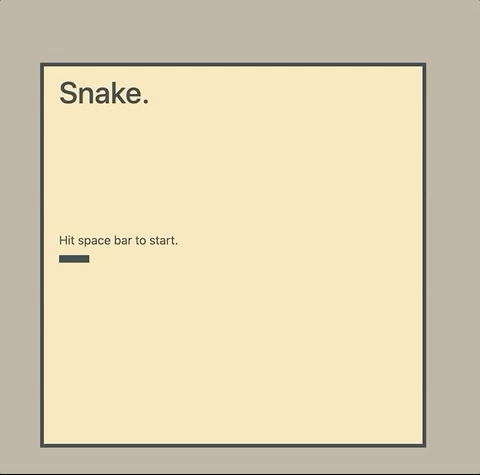

# sei-23-project-1
Project 1 for SEI-23

<a href="https://siu-sing.github.io/snake/" target="_blank">Snake</a>

### Objectives
- Create basic Game UI with HTML, JS and CSS
- Practice DOM manipulation from js and user input
- Develop algorithm in js replicate the snake mechanics

### MVP 
This was the original MVP plan at the start of the project:
- Game board maybe 100 x 100 units
- A “snake” (1 unit) to start on the middle of the board
- The snake is maneuverable by the player with arrow keys
- The snake can “eat the objects” (i.e. object disappears)

### Other Features
- Snake increases in length for each object eaten
- Snake is more than 1 px and follows the trail as it moves
- Snake dies on contact with walls or itself
- Scoreboard, round indicator, game restarts, basic styling

### Game Structure - DOM, Game Objects
#### Game Board
The game board consists of a 50 x 50 (configurable) grid of divs, each with a fixed size of 10px. Background color of the divs are switched on/off to animate the game objects at 100ms intervals. Bootstrap was used to organize and centralize the game board and additional CSS styles to fix default sizes and colours.

#### Snake
The snake is represented by a js object which records the state of the snake at every refresh interval.  

The `position` property stores an array of coordinate objects representing the coordinate of each segment of the snake.  

    // a 4 unit snake with its head at position (24,5) on the grid, facing east.
    position: [ {i:24, j:5}, {i:24, j:4}, {i:24, j:3}, {i:24, j:2} ] 

The `direction` property keeps track of the current bearing of the snake and takes the values `n`, `s`, `e`, or `w`. This can be dynamically changed by the event listener on the user's arrow keys.

The `move()` function in the snake object is called at every 100ms interval to update the position of the snake based on its `position` and `direction` values. 

Every time `move()` is executed:
1. Starting from the tail, each segment's coordinate is updated to the one in front of it.
2. The head of the snake is incremented 1 unit in the direction of the `direction` value. 

This ensures that the snake constantly follows through the trail of its head, whichever path it takes.

#### Apple
The apple is also represented by an object, but contains only 1 coordinate object `position: {i,j}`. 

An object method `resetPosition()` was created to reset the position of the apple during game play. The function has an additional check to ensures the new apple does not spawn within the snake.

### Overall Game Flow 

- "Animation" of snake kicks off based on default direction of snake
- Snake direction is updated based on the arrow key press by the user
- At every refresh interval, the snake gets "re-drawn" based on the direction of the snake 
- Each refresh of the snake will check 3 things:

|Condition						|Yes				|No		|
|:-------------------------------|:-------------------|:-------|
|Is snake out of bounds?		| Dies. Game over.	| Continue movement|
|Did snake collide with itself?	| Dies. Game over.	| Continue movement|
|Did snake eat the apple?		| Increment snake by one segment, inserted at tail | Continue movement|

### Styling 
- Fade in/out animation of the game title and start game instructions
